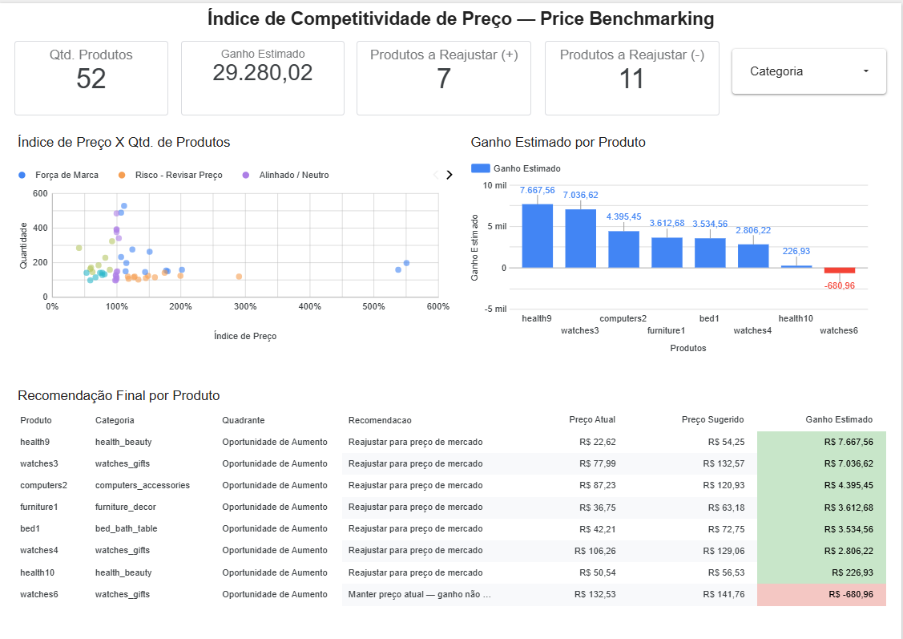

# Índice de Competitividade de Preço e Priorização de Reajuste (Price Benchmarking)

**Ferramentas:** Google Sheets (PROCV, Tabela Dinâmica, Funções de Array) + Looker Studio
**Dataset:** Retail Price Optimization Dataset
**Link:** https://www.kaggle.com/datasets/suddharshan/retail-price-optimization

---

## 1. Problema de Negócio

A área de Pricing precisa decidir, produto a produto, onde reajustar preço sem perder competitividade no mercado. Hoje a decisão é feita "no olho", sem cruzar preço próprio, preço da concorrência e volume vendido. Este projeto constrói um Índice de Competitividade de Preço que aponta, com dado, quais produtos têm espaço para reajuste e quais estão em risco por estarem acima do mercado.

## 2. Premissas

- **Índice de Preço = Preço Próprio / Preço Médio dos Concorrentes.** Índice > 105% = acima do mercado; < 95% = abaixo do mercado; entre 95% e 105% = alinhado.
- **Volume Alto/Baixo** foi definido pela **mediana** do volume vendido (143 unidades), não pela média — a média (188) estava distorcida por outliers de alto volume (ex.: produtos com mais de 480 unidades vendidas no período).
- Base validada previamente quanto a valores nulos/em branco nas colunas de concorrência (`comp_1`, `comp_2`, `comp_3`) — nenhuma ocorrência encontrada, dado limpo.
- Para a simulação de reajuste, assumiu-se manutenção de **92% do volume** de venda após o aumento de preço (premissa de elasticidade simplificada, documentada — não é dado real de teste A/B).

## 3. Perguntas de Negócio

1. Qual o Índice de Preço (próprio vs. concorrência) por produto e por categoria?
2. Quais produtos estão abaixo do mercado e vendendo bem — oportunidade de aumentar preço sem perder venda?
3. Quais produtos estão acima do mercado e com volume baixo — risco, candidatos a redução ou revisão de posicionamento?
4. Qual a banda de preço competitivo (mínimo e máximo praticado pela concorrência) por categoria?
5. Se reajustarmos os produtos "abaixo do mercado" para a média da concorrência, assumindo manutenção de 92% do volume, qual o ganho de receita estimado?

## 4. Estratégia da Solução

1. **Índice de Preço no Google Sheets** — cálculo por produto/mês, classificado em 3 faixas (Abaixo/Alinhado/Acima do mercado).
2. **Matriz de Priorização (Quadrante)** — cruzamento do Índice de Preço com o volume de vendas, classificando os 52 produtos em 5 categorias de decisão: Oportunidade de Aumento, Risco - Revisar Preço, Força de Marca, Investigar Causa e Alinhado/Neutro.
3. **Banda de Preço Competitivo por Categoria** — faixa mínima e máxima praticada pela concorrência nas 8 categorias do catálogo.
4. **Simulação de Impacto Financeiro** — projeção de receita para os produtos com oportunidade de reajuste.
5. **Dashboard no Looker Studio** — KPIs executivos, gráfico de dispersão por quadrante (colorido por categoria de decisão), ranking de ganho estimado por produto e tabela de recomendação final com formatação condicional.

## 5. Insights

- Dos 52 produtos analisados, **8 foram classificados como "Oportunidade de Aumento"** (preço abaixo do mercado + volume consistente de venda) e **11 como "Risco - Revisar Preço"** (preço acima do mercado + volume baixo).
- **Nem todo produto "abaixo do mercado" compensa reajuste**: o produto `watches6`, com índice de 94% (muito próximo da faixa "Alinhado"), apresentou ganho estimado **negativo** mesmo sendo classificado como oportunidade — a margem de preço era pequena demais para compensar a queda de volume assumida (92%). Já produtos com gap de preço maior (ex.: `health9`, índice de 42%) apresentaram folga suficiente para justificar reajuste com sobra.
- A categoria `watches_gifts` apresentou a maior banda de preço competitivo (de R$ 78,00 a R$ 346,16), sinalizando um mix de produtos muito heterogêneo (itens de entrada e itens premium competindo na mesma categoria).
- A categoria `health_beauty` também mostrou banda ampla (R$ 19,99 a R$ 349,90), indicando necessidade de segmentação mais fina antes de qualquer decisão de reajuste em massa.

## 6. Resultado / Impacto Financeiro

- **7 dos 8 produtos identificados como oportunidade** compensam reajuste para a média de mercado, mesmo com a premissa conservadora de perda de 8% no volume de venda.
- **Ganho de receita estimado: R$ 29.280,02** (soma líquida dos produtos com retorno positivo).
- Considerando o efeito líquido de todos os 8 produtos analisados (incluindo o caso de retorno negativo do `watches6`), o ganho total agregado é de R$ 28.599,06.

> *"Identifiquei 8 produtos vendendo abaixo do preço médio da concorrência, mesmo com volume consistente. Reajustar os 7 que apresentam retorno positivo para a média de mercado gera um ganho estimado de R$ 29.280, considerando uma queda conservadora de 8% no volume de venda."*

## 7. Próximos Passos

- Automatizar a atualização do Índice de Preço com coleta periódica de preço de concorrência (web scraping ou fonte de mercado).
- Refinar a premissa de elasticidade (92% de volume mantido) com dado real de teste A/B de preço, quando disponível.
- Aplicar o mesmo framework de quadrante às categorias com maior banda de preço (`watches_gifts`, `health_beauty`), investigando se a heterogeneidade de preço reflete diferença real de produto ou oportunidade de segmentação de portfólio.

---

## Dashboard interativo: 
[[Looker Studio](https://datastudio.google.com/reporting/d20f3a3c-645f-40bd-93c8-4da1ebaebf55)]

## Planilha de trabalho:
[[Google Sheets](https://docs.google.com/spreadsheets/d/1-JksRkV6LgfLoUmPD37aHubbm8fboggUP1pN7wxcvRM/edit?usp=sharing)]
